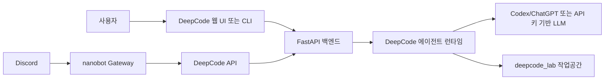

# DeepCode

DeepCode는 논문, 요구사항, URL, 대화형 기획 내용을 입력으로 받아 실행 가능한 코드 프로젝트를 생성하는 AI 코드 생성 플랫폼입니다. 웹 UI, CLI, Docker 실행을 모두 지원하며, `nanobot`을 함께 실행하면 Discord 같은 채팅 앱에서 DeepCode 작업을 요청하고 진행 상태를 확인할 수 있습니다.

이 저장소의 기본 설정은 Codex/ChatGPT 웹 로그인을 사용합니다. 처음 실행할 때 API 키를 넣지 않고도 설정 화면에서 ChatGPT 계정으로 로그인한 뒤 `codex/gpt-5.5` 계열 모델을 사용할 수 있습니다. OpenAI, Anthropic, OpenRouter, Gemini 같은 API 키 기반 제공자도 계속 지원합니다.

## 주요 기능

- 논문 PDF, arXiv URL, GitHub URL, 일반 요구사항을 코드 프로젝트로 변환
- 계획 검토와 추가 질문을 포함한 User-in-Loop 워크플로우
- 작업 단위 로그와 세션 저장
- 한국어 UI와 한국어 설정 메시지
- Codex/ChatGPT 브라우저 로그인 기반 LLM 제공자
- OpenRouter 모델 검색과 런타임 모델 변경
- Docker Compose 기반 DeepCode + nanobot 통합 실행
- Discord, Feishu, Telegram 등 채팅 채널을 통한 원격 작업 요청

## 구조



## 요구 사항

- Python 3.11 이상 권장
- Node.js 18 이상
- Docker Desktop, Docker 실행 모드를 사용할 경우
- Codex/ChatGPT 웹 로그인 사용 시 브라우저 접근 가능 환경
- Discord 연동 시 Discord Developer Portal 접근 권한과 서버 관리자 또는 봇 초대 권한

## 빠른 시작

### 1. 저장소 준비

```powershell
git clone git@github.com:mindok7520/DeepCode.git
cd DeepCode
```

이미 저장소를 받은 상태라면 이 단계는 건너뛰어도 됩니다.

### 2. 설정 파일 생성

```powershell
Copy-Item deepcode_config.json.example deepcode_config.json
```

기본 예제 설정은 다음과 같이 Codex 제공자를 사용합니다.

```json
{
  "agents": {
    "defaults": {
      "provider": "codex",
      "model": "codex/gpt-5.5"
    },
    "planning": {
      "provider": "codex",
      "model": "codex/gpt-5.5"
    },
    "implementation": {
      "provider": "codex",
      "model": "codex/gpt-5.5"
    }
  },
  "providers": {
    "codex": {}
  }
}
```

`deepcode_config.json`은 개인 설정과 인증 정보를 담는 파일이므로 커밋하지 마세요. 저장소의 `.gitignore`에 이미 제외되어 있습니다.

### 3. 로컬 실행

```powershell
pip install -r requirements.txt
npm install --prefix new_ui/frontend
python deepcode.py --local
```

실행 후 브라우저에서 다음 주소를 엽니다.

- 프론트엔드: `http://localhost:5173`
- 백엔드 API: `http://localhost:8000`

### 4. Docker 실행

```powershell
docker compose -f deepcode_docker/docker-compose.yml up --build
```

Docker 모드에서는 DeepCode가 `http://localhost:8000`에서 실행됩니다. Compose 설정에는 Codex 로그인 콜백 포트 `1455`, `1457`과 `/root/.codex` 영구 볼륨이 포함되어 있습니다.

## Codex/ChatGPT 웹 로그인

DeepCode는 로컬 Codex 인증 파일인 `~/.codex/auth.json`을 사용합니다. API 키를 직접 저장하는 방식이 아니라 브라우저에서 ChatGPT 계정으로 로그인하고, DeepCode가 해당 세션 토큰을 읽어 Codex 모델 목록과 응답 API를 호출합니다.

절차는 다음과 같습니다.

1. DeepCode를 실행합니다.
2. 웹 UI에서 `설정` 페이지로 이동합니다.
3. 제공자를 `Codex/ChatGPT 웹 로그인`으로 선택합니다.
4. `웹 로그인` 버튼을 누릅니다.
5. 새 브라우저 창에서 ChatGPT 계정으로 로그인합니다.
6. 콜백이 완료되면 설정 화면에서 인증 상태와 사용 가능한 모델을 확인합니다.
7. 기본, 계획, 구현 모델을 선택하고 저장합니다.

Docker에서 로그인할 때는 Compose가 `1455:1455`, `1457:1457` 포트를 열어 둡니다. 로컬 방화벽이나 보안 프로그램이 해당 포트를 막고 있으면 로그인 콜백이 실패할 수 있습니다.

로그아웃은 설정 화면의 `로그아웃` 버튼으로 처리합니다. 이 작업은 현재 `CODEX_HOME` 아래의 `auth.json`을 삭제합니다.

## API 키 기반 제공자 사용

Codex 대신 API 키 기반 제공자를 쓰려면 `deepcode_config.json`의 provider와 model을 바꿉니다.

OpenRouter 예시는 다음과 같습니다.

```json
{
  "agents": {
    "defaults": {
      "provider": "openrouter",
      "model": "anthropic/claude-sonnet-4.5"
    },
    "planning": {
      "provider": "openrouter",
      "model": "anthropic/claude-sonnet-4.5"
    },
    "implementation": {
      "provider": "openrouter",
      "model": "anthropic/claude-sonnet-4.5"
    }
  },
  "providers": {
    "openrouter": {
      "apiKey": "sk-or-v1-...",
      "apiBase": "https://openrouter.ai/api/v1"
    }
  }
}
```

웹 UI의 설정 화면에서도 OpenRouter 모델을 검색하고 기본, 계획, 구현 모델을 저장할 수 있습니다. 저장 후 새로 시작하는 워크플로우부터 변경된 모델을 사용합니다.

## 주요 사용 흐름

### 논문을 코드로 변환

1. 웹 UI의 `논문 구현` 화면으로 이동합니다.
2. PDF 파일을 업로드하거나 논문 URL을 입력합니다.
3. 작업을 시작합니다.
4. 계획 검토나 추가 질문이 나오면 화면에서 응답합니다.
5. 결과 파일과 로그를 확인합니다.

### 요구사항으로 코드 생성

1. `채팅 기획` 화면으로 이동합니다.
2. 만들고 싶은 앱, 라이브러리, 실험 코드 요구사항을 한국어 또는 영어로 입력합니다.
3. DeepCode가 질문, 요구사항 요약, 구현 계획을 단계적으로 구성합니다.
4. 생성된 코드는 `deepcode_lab/tasks/` 아래에 저장됩니다.

### 세션 관리

CLI 세션은 `~/.deepcode/sessions/`에 저장됩니다.

```powershell
python cli/main_cli.py session list
python cli/main_cli.py session show <session_id>
python cli/main_cli.py session resume <session_id>
python cli/main_cli.py --session <session_id> --file paper.pdf
```

웹 UI에서는 헤더의 세션 메뉴에서 이전 작업을 다시 열거나 삭제할 수 있습니다.

## Discord 연동 개요

Discord 연동은 DeepCode가 직접 Discord 웹훅을 받는 방식이 아닙니다. `nanobot`이 Discord Gateway websocket에 연결해 메시지를 받고, 필요할 때 Docker 내부 네트워크의 DeepCode API(`http://deepcode:8000`)를 호출합니다.

따라서 필요한 파일은 두 개입니다.

- `deepcode_config.json`: DeepCode 자체 LLM과 MCP 설정
- `nanobot_config.json`: Discord 봇 토큰, Discord 접근 제어, nanobot용 LLM provider 설정

nanobot도 사용자 메시지를 해석하고 DeepCode 도구를 호출하기 위해 별도의 LLM provider가 필요합니다. 예제 파일은 OpenRouter를 기본 예시로 둡니다.

## Discord 연동 상세 절차

### 1. nanobot 설정 파일 생성

```powershell
Copy-Item nanobot_config.json.example nanobot_config.json
```

Windows PowerShell이 아니라 Git Bash 또는 WSL을 쓰는 경우에는 다음 명령도 가능합니다.

```bash
cp nanobot_config.json.example nanobot_config.json
```

### 2. Discord 애플리케이션과 봇 만들기

1. [Discord Developer Portal](https://discord.com/developers/applications)에 접속합니다.
2. `New Application`을 누르고 애플리케이션 이름을 입력합니다.
3. 왼쪽 메뉴에서 `Bot`을 선택합니다.
4. `Add Bot` 또는 기존 봇 설정 화면으로 이동합니다.
5. `Reset Token` 또는 `View Token`으로 봇 토큰을 확인합니다.
6. 토큰은 한 번만 안전하게 복사하고 외부에 공유하지 않습니다.

### 3. Gateway Intent 켜기

Discord 채널 메시지 내용을 읽으려면 Message Content Intent가 필요합니다.

1. Developer Portal의 `Bot` 화면으로 이동합니다.
2. `Privileged Gateway Intents` 섹션을 찾습니다.
3. `Message Content Intent`를 켭니다.
4. 저장합니다.

현재 nanobot Discord 채널의 기본 intents 값은 `37377`입니다. 이 값은 `GUILDS`, `GUILD_MESSAGES`, `DIRECT_MESSAGES`, `MESSAGE_CONTENT`를 포함하는 기본값입니다. 특별한 이유가 없다면 바꾸지 마세요.

### 4. Discord User ID 확인

보안을 위해 `allowFrom`에 사용할 Discord 사용자 ID를 확인합니다.

1. Discord 앱에서 `User Settings`로 이동합니다.
2. `Advanced`에서 `Developer Mode`를 켭니다.
3. 자신의 프로필 또는 메시지를 우클릭합니다.
4. `Copy User ID`를 선택합니다.

`allowFrom`을 비워 두면 봇이 접근 가능한 채널에서 들어오는 모든 사용자 메시지를 처리합니다. 개인 서버가 아니라면 반드시 허용할 사용자 ID를 지정하세요.

### 5. 봇 초대 URL 만들기

1. Developer Portal에서 `OAuth2` -> `URL Generator`로 이동합니다.
2. Scopes에서 `bot`을 선택합니다.
3. Bot Permissions에서 최소 권한을 선택합니다.
   - `View Channels`
   - `Send Messages`
   - `Read Message History`
4. 파일 첨부 응답까지 허용하려면 `Attach Files`도 추가합니다.
5. 생성된 URL을 열어 봇을 원하는 서버에 초대합니다.

이 구현은 slash command를 등록하지 않습니다. 일반 메시지와 DM을 Gateway 이벤트로 받아 처리하므로 `applications.commands` scope는 필수는 아닙니다.

### 6. nanobot_config.json 편집

아래 예시는 Discord만 켜고, nanobot의 LLM provider로 OpenRouter를 사용하는 구성입니다.

```json
{
  "channels": {
    "feishu": {
      "enabled": false,
      "appId": "",
      "appSecret": "",
      "encryptKey": "",
      "verificationToken": "",
      "allowFrom": []
    },
    "telegram": {
      "enabled": false,
      "token": "",
      "allowFrom": []
    },
    "discord": {
      "enabled": true,
      "token": "YOUR_DISCORD_BOT_TOKEN",
      "allowFrom": ["YOUR_DISCORD_USER_ID"],
      "gatewayUrl": "wss://gateway.discord.gg/?v=10&encoding=json",
      "intents": 37377
    }
  },
  "providers": {
    "openrouter": {
      "apiKey": "sk-or-v1-your_openrouter_key"
    }
  },
  "agents": {
    "defaults": {
      "model": "anthropic/claude-sonnet-4-20250514",
      "workspace": "/root/.nanobot/workspace",
      "maxTokens": 8192,
      "temperature": 0.7
    }
  },
  "gateway": {
    "host": "0.0.0.0",
    "port": 18790
  },
  "tools": {
    "web": {},
    "exec": {
      "timeout": 120
    },
    "restrictToWorkspace": false
  }
}
```

중요한 필드는 다음과 같습니다.

- `channels.discord.enabled`: Discord 채널 사용 여부
- `channels.discord.token`: Discord Developer Portal에서 복사한 Bot Token
- `channels.discord.allowFrom`: 허용할 Discord 사용자 ID 목록
- `channels.discord.gatewayUrl`: Discord Gateway endpoint, 기본값 유지 권장
- `channels.discord.intents`: Gateway 이벤트 구독 비트마스크, 기본값 유지 권장
- `providers.openrouter.apiKey`: nanobot이 사용할 LLM provider 키
- `agents.defaults.model`: nanobot이 메시지를 해석할 때 사용할 모델

### 7. DeepCode + nanobot 실행

Docker Compose 통합 실행을 권장합니다.

Git Bash 또는 WSL:

```bash
./nanobot/run_nanobot.sh -d
```

Windows PowerShell에서 스크립트 실행이 불편하면 Compose를 직접 사용합니다.

```powershell
docker compose -f deepcode_docker/docker-compose.yml up --build -d
```

상태와 로그 확인:

```powershell
docker compose -f deepcode_docker/docker-compose.yml ps
docker compose -f deepcode_docker/docker-compose.yml logs -f nanobot
docker compose -f deepcode_docker/docker-compose.yml logs -f deepcode
```

정상적으로 연결되면 nanobot 로그에 Discord Gateway READY 메시지가 표시됩니다.

### 8. Discord에서 사용하기

봇이 들어간 서버 채널이나 봇 DM에서 자연어로 요청합니다.

예시:

```text
이 arXiv 논문을 DeepCode로 구현해줘: https://arxiv.org/pdf/....
```

```text
FastAPI와 React로 간단한 이슈 트래커를 만들어줘. DeepCode 작업으로 시작하고 진행 상태도 알려줘.
```

nanobot은 사용자 메시지를 해석한 뒤 필요한 경우 다음 DeepCode 도구를 호출합니다.

- `deepcode_paper2code`: 논문 URL 또는 파일 경로를 DeepCode 작업으로 제출
- `deepcode_chat2code`: 일반 요구사항을 DeepCode 작업으로 제출
- `deepcode_status`: 작업 진행 상태 확인
- `deepcode_list_tasks`: 최근 작업 목록 조회
- `deepcode_cancel`: 실행 중인 작업 취소
- `deepcode_respond`: DeepCode가 사용자 입력을 기다릴 때 응답 전달

첨부 파일은 Discord 메시지의 attachment URL을 다운로드해서 nanobot media 디렉터리에 저장합니다. 현재 Discord 채널 구현은 20MB를 넘는 첨부 파일을 건너뜁니다.

## Discord 문제 해결

| 증상 | 확인할 것 | 해결 방법 |
| --- | --- | --- |
| nanobot 로그에 `Discord bot token not configured`가 보임 | `nanobot_config.json`의 `channels.discord.token` | 실제 Bot Token을 넣고 컨테이너 재시작 |
| Discord Gateway READY가 보이지 않음 | 인터넷 연결, 토큰, Gateway URL | 토큰 재발급, `gatewayUrl` 기본값 복구, `docker compose logs -f nanobot` 확인 |
| 봇이 메시지를 못 읽음 | Message Content Intent | Developer Portal에서 `Message Content Intent`를 켜고 저장 |
| 봇이 채널에서 답하지 않음 | 서버/채널 권한 | `View Channels`, `Send Messages`, `Read Message History` 권한 부여 |
| 특정 사용자 메시지만 무시됨 | `allowFrom` 값 | Discord User ID가 정확한지 확인하거나 임시로 빈 배열로 테스트 |
| DeepCode 작업 호출이 실패함 | DeepCode 컨테이너 상태 | `curl http://localhost:8000/health` 또는 Compose 로그 확인 |
| 설정 변경이 반영되지 않음 | 컨테이너 재시작 여부 | `docker compose -f deepcode_docker/docker-compose.yml restart nanobot` |

## 운영 명령

DeepCode Docker:

```powershell
docker compose -f deepcode_docker/docker-compose.yml up --build
docker compose -f deepcode_docker/docker-compose.yml down
docker compose -f deepcode_docker/docker-compose.yml logs -f
```

nanobot 통합 스크립트:

```bash
./nanobot/run_nanobot.sh
./nanobot/run_nanobot.sh -d
./nanobot/run_nanobot.sh stop
./nanobot/run_nanobot.sh restart
./nanobot/run_nanobot.sh logs
./nanobot/run_nanobot.sh status
```

로컬 개발:

```powershell
python deepcode.py --local
npm run build --prefix new_ui/frontend
python -m compileall core new_ui/backend
```

## 보안 주의

- `deepcode_config.json`, `nanobot_config.json`, `.env`, `~/.codex/auth.json`은 커밋하지 마세요.
- Discord Bot Token이 노출되면 Developer Portal에서 즉시 재발급하세요.
- 공개 서버에서 Discord 봇을 쓸 때는 `allowFrom`을 반드시 설정하세요.
- Docker에서 Codex 로그인을 사용할 경우 `codex-home` 볼륨에 인증 파일이 유지됩니다. 공유 환경에서는 볼륨 권한과 접근자를 확인하세요.
- nanobot의 `tools.restrictToWorkspace`를 `true`로 바꾸면 파일 작업 범위를 workspace로 제한할 수 있습니다.

## 라이선스와 인용

원 프로젝트 라이선스와 인용 정보는 저장소의 `LICENSE` 및 논문 정보를 따릅니다.

```bibtex
@misc{li2025deepcodeopenagenticcoding,
  title={DeepCode: Open Agentic Coding},
  author={Li, et al.},
  year={2025}
}
```
